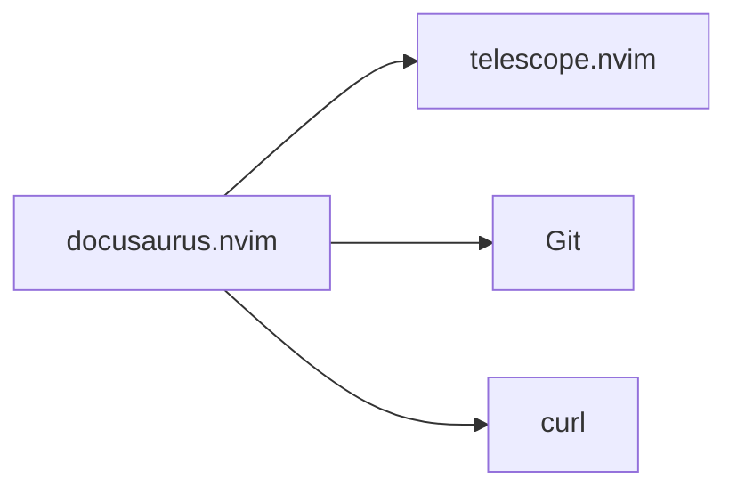

# Docusaurus.nvim

import Tabs from '@theme/Tabs';
import TabItem from '@theme/TabItem';

> Streamlines Docusaurus documentation editing with version-aware content insertion and intelligent imports.

| | |
|---|---|
| **Repository** | [Piotr1215/docusaurus.nvim](https://github.com/Piotr1215/docusaurus.nvim) |
| **Category** | Utility / Documentation |
| **Our Config** | `lua/custom/plugins/docusaurus.lua` |
| **Fork** | `MisterGrinvalds/Piotr1215.docusaurus.nvim` |

## What It Does

Docusaurus.nvim is a specialized Neovim plugin designed for developers working with Docusaurus documentation projects. It provides intelligent content insertion that understands your project's versioned folder structure.

The plugin automatically detects which documentation version you're editing and filters search results accordingly. When inserting imports, it intelligently chooses between `@site` absolute imports and relative imports based on your file's location in the project structure.

This is particularly valuable for large documentation projects with multiple versions, where manually managing imports and cross-references becomes tedious and error-prone.

:::info Why We Use This
Essential for maintaining Docusaurus documentation with proper version isolation and consistent import patterns across the codebase.
:::

## Key Concepts

### Version-Aware Filtering

The plugin detects your current file's version context and filters content accordingly:

- **Versioned docs** (e.g., `vcluster_versioned_docs/version-0.20.x/`): Shows version-specific partials plus root docs
- **Project-specific docs** (e.g., `vcluster/`): Shows only that project's content
- **Non-versioned docs**: Shows all available content

### Smart Import Detection

Based on your file location, the plugin automatically chooses:
- **`@site` imports**: For non-versioned content in allowed paths
- **Relative imports**: For versioned content to maintain isolation

## Features

| Feature | Description | Command/Keymap |
|---------|-------------|----------------|
| Insert Component | Select React component with auto-import | `<leader>Dc` |
| Insert Partial | Insert partial/fragment with smart import | `<leader>Dp` |
| Insert Code Block | Insert code block with raw-loader | `<leader>Db` |
| Insert URL | Create markdown link with path calculation | `<leader>Du` |
| Create Plugin | Scaffold new Docusaurus plugin | `<leader>Dn` |
| Browse API | Access Docusaurus config API docs | `<leader>Da` |

## Our Configuration

```lua title="lua/custom/plugins/docusaurus.lua" showLineNumbers
local fork = require('lib.forks').fork

return {
  fork('Piotr1215/docusaurus.nvim'),
  dependencies = { 'nvim-telescope/telescope.nvim' },
  ft = { 'markdown', 'mdx' },
  cmd = {
    'DocusaurusInsertComponent',
    'DocusaurusInsertPartial',
    'DocusaurusInsertCodeBlock',
    'DocusaurusInsertURL',
    'DocusaurusCreatePlugin',
    'DocusaurusBrowseAPI',
  },
  config = function()
    require('docusaurus').setup {
      -- Customize for your project:
      -- components_dir = "~/project/src/components",
      -- partials_dirs = { "_partials", "_fragments", "_code" },
      -- allowed_site_paths = { "^docs/_" },
    }

    -- Keymaps under <leader>D for Docusaurus
    vim.keymap.set('n', '<leader>Dc', '<cmd>DocusaurusInsertComponent<cr>',
      { desc = '[D]ocusaurus insert [C]omponent' })
    vim.keymap.set('n', '<leader>Dp', '<cmd>DocusaurusInsertPartial<cr>',
      { desc = '[D]ocusaurus insert [P]artial' })
    vim.keymap.set('n', '<leader>Db', '<cmd>DocusaurusInsertCodeBlock<cr>',
      { desc = '[D]ocusaurus insert code [B]lock' })
    vim.keymap.set('n', '<leader>Du', '<cmd>DocusaurusInsertURL<cr>',
      { desc = '[D]ocusaurus insert [U]RL' })
    vim.keymap.set('n', '<leader>Dn', '<cmd>DocusaurusCreatePlugin<cr>',
      { desc = '[D]ocusaurus [N]ew plugin' })
    vim.keymap.set('n', '<leader>Da', '<cmd>DocusaurusBrowseAPI<cr>',
      { desc = '[D]ocusaurus browse [A]PI' })
  end,
}
```

<details>
<summary>Why These Settings</summary>

- **`ft = { 'markdown', 'mdx' }`**: Only loads for documentation files, keeping startup fast
- **`cmd = {...}`**: Lazy loads on first command use
- **`<leader>D` prefix**: Groups all Docusaurus commands under one memorable prefix
- **Default config**: Works out of the box, customize paths per-project as needed

</details>

## Keymaps

:::tip Quick Reference
All Docusaurus keymaps use the `<leader>D` prefix for easy discovery.
:::

| Keymap | Mode | Action | When to Use |
|--------|------|--------|-------------|
| `<leader>Dc` | n | Insert component | Adding React components to docs |
| `<leader>Dp` | n | Insert partial | Reusing content fragments |
| `<leader>Db` | n | Insert code block | Embedding code with syntax highlighting |
| `<leader>Du` | n | Insert URL | Cross-referencing other docs |
| `<leader>Dn` | n | Create plugin | Scaffolding new Docusaurus plugins |
| `<leader>Da` | n | Browse API | Looking up config options |

## Commands

| Command | Description | Example |
|---------|-------------|---------|
| `:DocusaurusInsertComponent` | Pick and insert React component | Opens Telescope picker |
| `:DocusaurusInsertPartial` | Pick and insert partial with import | Auto-detects import style |
| `:DocusaurusInsertCodeBlock` | Insert code block with raw-loader | For embedding code files |
| `:DocusaurusInsertURL` | Create markdown link | Calculates relative paths |
| `:DocusaurusCreatePlugin` | Scaffold new plugin | Interactive plugin creation |
| `:DocusaurusBrowseAPI` | Browse Docusaurus API | Requires curl |

## Common Workflows

<Tabs>
<TabItem value="component" label="Insert Component" default>

1. Open a markdown/mdx file in your Docusaurus project
2. Press `<leader>Dc` to open the component picker
3. Search and select the component you need
4. The component is inserted with proper import statement

</TabItem>
<TabItem value="partial" label="Reuse Content">

1. Create reusable content in `_partials/` directory
2. In any doc file, press `<leader>Dp`
3. Select the partial from the version-filtered list
4. Import and include statement are added automatically

</TabItem>
<TabItem value="crossref" label="Cross-Reference Docs">

1. Position cursor where you want the link
2. Press `<leader>Du`
3. Search for the target documentation file
4. A properly formatted markdown link is inserted

</TabItem>
</Tabs>

## Local Development Server

:::warning Not Included
**docusaurus.nvim does NOT include local server functionality.** It focuses on content editing workflows only.
:::

To run a local Docusaurus dev server, use these terminal commands:

```bash
# Start development server (opens http://localhost:3000)
npm start
# or
yarn start
```

### Suggested Integration

For running the dev server from Neovim, consider using:

1. **terminal-manager.nvim** (already installed):
   ```lua
   -- Create a dedicated Docusaurus terminal
   vim.keymap.set('n', '<leader>Ds', function()
     require('terminal-manager').open_or_create('docusaurus')
     vim.defer_fn(function()
       vim.api.nvim_feedkeys('npm start\n', 'n', false)
     end, 100)
   end, { desc = '[D]ocusaurus [S]erver' })
   ```

2. **[live-server.nvim](https://github.com/barrett-ruth/live-server.nvim)**: General purpose live reload for web development

## Integration Points



- **Works with:** telescope.nvim (required for pickers)
- **Requires:** Git (for project root detection), curl (optional, for API browsing)
- **Conflicts with:** None known

## Tips & Tricks

:::tip Use Version Context
The plugin automatically detects your version context. Work within versioned folders to get properly filtered results.
:::

:::tip Customize Per-Project
Add project-specific paths to your config for better partial discovery:
```lua
partials_dirs = { "_partials", "_snippets", "_shared" }
```
:::

:::tip Create Plugins Quickly
Use `<leader>Dn` to scaffold new Docusaurus plugins with proper structure instead of creating files manually.
:::

## Troubleshooting

<details>
<summary>Telescope picker is empty</summary>

**Problem:** No components or partials appear in the picker.

**Solution:**
1. Ensure you're in a git repository
2. Check that `components_dir` path is correct
3. Verify partials exist in one of the `partials_dirs`

</details>

<details>
<summary>Wrong import style used</summary>

**Problem:** Getting relative imports when you expect `@site` or vice versa.

**Solution:**
Adjust `allowed_site_paths` to match your project structure:
```lua
allowed_site_paths = { "^docs/_", "^shared/" }
```

</details>

<details>
<summary>API browsing not working</summary>

**Problem:** `:DocusaurusBrowseAPI` fails or shows nothing.

**Solution:**
Ensure `curl` is installed and accessible in your PATH.

</details>

## Advanced Configuration

:::warning Advanced Users Only
These settings are for power users with non-standard Docusaurus project layouts.
:::

```lua title="Advanced options"
require("docusaurus").setup({
  -- Custom components location
  components_dir = vim.fn.getcwd() .. "/src/components",

  -- Additional partial directories
  partials_dirs = {
    "_partials",      -- Standard partials
    "_fragments",     -- Code fragments
    "_code",          -- Code examples
    "_includes",      -- Custom includes folder
  },

  -- Paths that should use @site imports
  -- (non-versioned, shared across all versions)
  allowed_site_paths = {
    "^docs/_",        -- Root docs partials
    "^shared/",       -- Shared content
    "^common/",       -- Common components
  },
})
```

## API Reference

| Function | Description |
|----------|-------------|
| `require("docusaurus").setup(opts)` | Initialize with config |
| `require("docusaurus").select_component()` | Open component picker |
| `require("docusaurus").select_partial()` | Open partial picker |
| `require("docusaurus").select_code_block()` | Open code block picker |
| `require("docusaurus").insert_url_reference()` | Open URL picker |
| `require("docusaurus").create_plugin()` | Start plugin scaffold wizard |
| `require("docusaurus").browse_api()` | Open API browser |
| `require("docusaurus").get_version_context(path, root)` | Get version info for path |
| `require("docusaurus").get_config()` | Get current config |

## Resources

- [GitHub Repository](https://github.com/Piotr1215/docusaurus.nvim)
- [Docusaurus Official Docs](https://docusaurus.io/docs)
- [Docusaurus CLI Commands](https://v1.docusaurus.io/docs/en/commands)

---

*Last updated: 2026-01-03*
